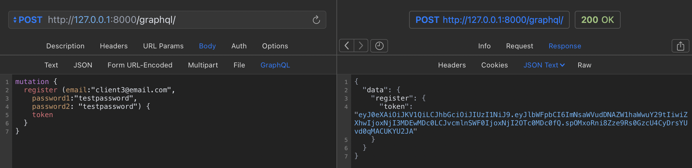
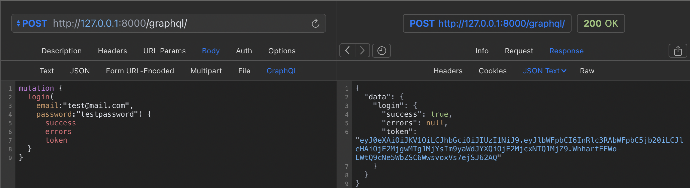
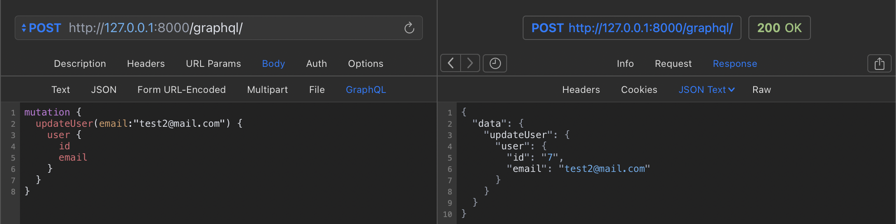
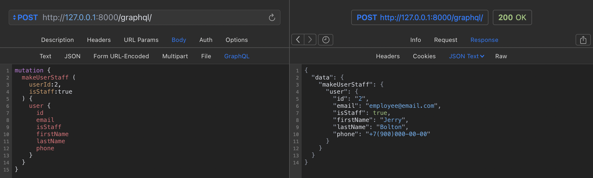
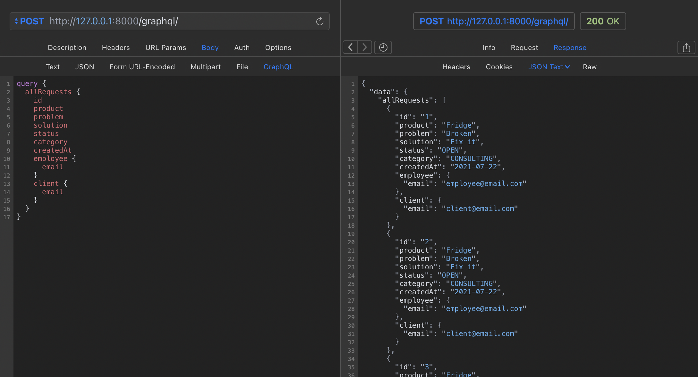
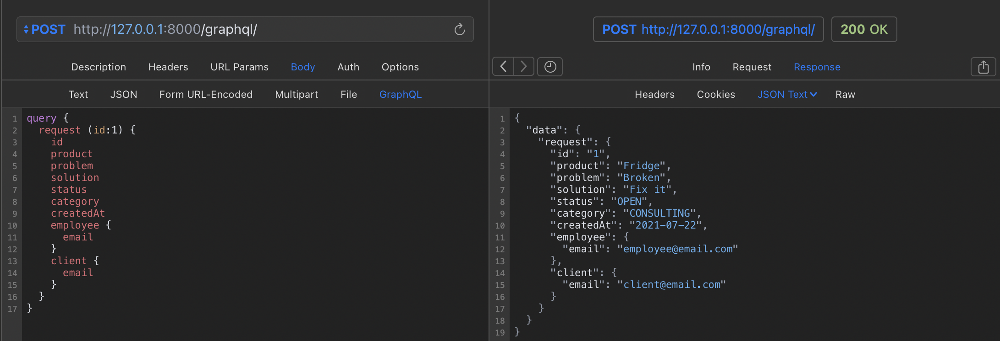
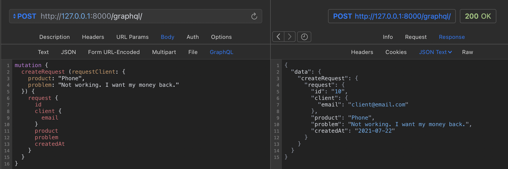
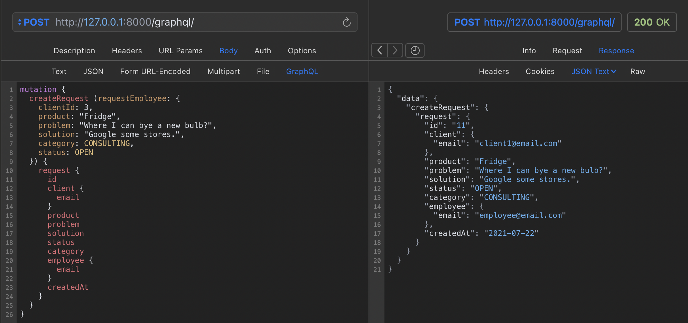
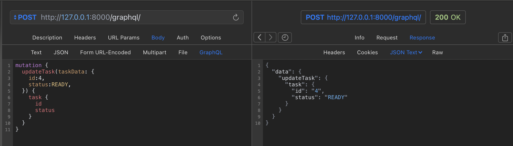

# CRM для регистрации и обработки входящих заявок от клиентов

## Пользователи

1. Клиент

2. Сотрудник компании (staff)

3. Администратор (superuser) - утверждает, что пользователь является сотрудником компании.

### Регистрация и аутентификация

Чтобы зарегистрировать пользователя необходимо воспользоваться **register Mutation**.

Обязательные поля для регистрации: почта и пароль.

Для входа на сервис используется JWT Token. Получаем через **login Mutation**.

Можно поменять дополнительные поля пользователя через **userUpdate Mutation**.

Доступные поля: имя, фамилия, телефон.

Дополнительные данные клиентов могут менять сотрудники компании.

Администратор утверждает сотрудников компании через **makeUserStaff Mutation**.

## Заявки

### Структура заявки

1. Клиент

2. Ответственный сотрудник по заявке

3. Техника покупателя

4. Тип заявки:

    - Консультация
    - Диагностика
    - Ремонт
    - Возврат
    - Жалоба
    - Прочее

5. Статус заявки:

    - Открыта
    - Запланирована
    - Отменена
    - Закрыта

6. Описание проблемы от клиента

7. Текущее/окончательное решение проблемы

### Получение данных

Пользователь / сотрудник может получить информацию по всем своим заявкам с помощью **allRequests Query**.

У администратора есть доступ ко всем заявкам.

Или доступ к определенной заявкой по ее ID с помощью **request Query**.

### Создание заявок

Пользователь / сотрудник может создать заявку с помощью **createRequest Mutation**.

У клиента есть доступ к полям техника, проблема. Выбрать поле заполнения **RequestInputClient**.

Данные клиента автоматически заполняются по данным входа.

У сотрудников есть доступ ко всем полям. Выбрать поле заполнения **RequestInputEmployee**.

Данные сотрудника автоматически заполняются по данным входа.

У пользователя нет доступа к **RequestInputClient**.

### Изменение заявок

Изменить заявку может только сотрудник ответственный за данную заявку или администратор.

Изменить заявку можно с помощью **updateRequest Mutation**.

