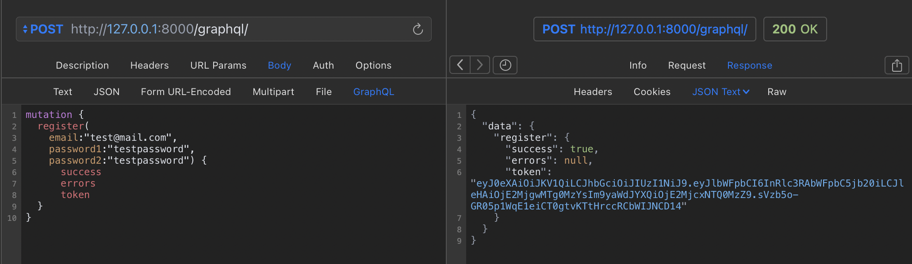

# CRM для регистрации и обработки входящих заявок от клиентов

[Нажмите, чтобы перейти на сервис](https://domclick.srezanova.me/graphql/)

## Пользователи

Пользователями сервиса являются сотрудники компании.

### Регистрация и аутентификация

Чтобы зарегистрировать пользователя необходимо воспользоваться **register Mutation**.

Необходимые поля для регистрации: почта и пароль.

Для входа на сервис используется JWT Token. Получаем его через **login Mutation**.

Пользователь может поменять свою почту с помощью **updateUser Mutation**

### Получение данных о пользователях

Пользователь может получить свои данные с помощью **me Query**.

## Клиенты

### Структура карточки клиента

1. ID клиента

2. Телеграм ID

3. Номер телефона

4. Имя

### Получение данных о клиенте

Пользовать может получить данные по всем клиентам **allCustomers Query** и по определенному клиенту по ID **customerById Query**.

### Создание карточки клиента

Пользователь создает карточку клиента с помощью **createCustomer mutation**.

Поле номер телефона уникальное.

### Изменение карточки клиента

Пользователь может изменить карточку клиента с помощью **updateCustomer mutation**.

Для изменения данных необходимо ввести номер телефона клиента.

Если у клиента поменялся номер телефона - создать новую карточку.

### Удаление карточки клиента

Пользователь может удалить карточку клиента с помощью **deleteCustomer mutation**.

При удалении карточки, в заявках в поле "Клиент" устанавливается пустое значение.

## Заявки

### Структура заявки

1. Номер заявки

2. Дата создания

3. Клиент

4. Ответственный сотрудник по заявке

5. Тип заявки:

   - Консультация
   - Диагностика
   - Ремонт
   - Прочее

6. Статус заявки:

   - Принято
   - В работе
   - Готово
   - Закрыто

7. Дополнительная информация (описание неисправности, результат консультации и т.д.)

### Получение данных о заявках

Доступ ко всем заявкам компании осуществляется через **allTasks Query**

#### Фильтры

- по клиентам(по номеру телефона)

- по статусам (одному или нескольким)

- по категориям

- по дате создания заявки

- по интервалу дат

Запрос заявки по ID через **taskById Query**.

### Создание заявок

Пользователь создает заявки с помощью **createTask Mutation**.

Клиент заполняется по полю номер телефона. Если такого клиента не существует в базе - создается новая карточка.

Данные пользователя как ответственного сотрудника по заявке автоматически заполняются по данным входа.

### Изменение заявок

Изменить заявку можно по ее ID с помощью **updateTask Mutation**.

Доступные поля для изменения: статус, тип заявки, описание.

### Удаление заявок

Удалить заявку можно по ее ID с помощью **deleteTask Mutation**.

## Telegram bot

При старте бот предлагает ввести телефон, в БД делается запись по клиенту с данными: telegram_id, номер телефона, имя из телеграмма

При любом вводе бот присылает список всех заявок.

При изменении статуса заявки бот отправляет уведомлении об изменении статуса.

## Работа сайта (частичный функционал для отображения возможностей сервиса)

На [домашней странице](https://domclick.srezanova.me/) отображены все заявки с фильтрами.

Можем создать заявку:

Отредактировать и удалить ее:

