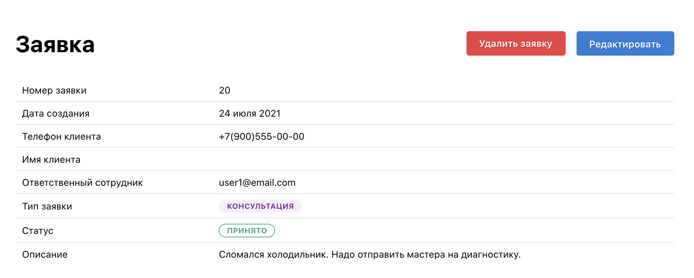

# Тестовое задание DomClick

## Демо

### CRM для регистрации и обработки входящих заявок от пользователей

- [GraphQL API](https://domclick.srezanova.me/graphql/)
- [Задеплоенное приложение](https://domclick.srezanova.me/)

**Работа сайта (частичный функционал для отображения возможностей сервиса):**

На [домашней странице](https://domclick.srezanova.me/) отображены все заявки с фильтрами.

Можем создать заявку:

Отредактировать и удалить ее:

## GraphQL API

Реализован с помощью Django и библиотеки [graphene-django](https://docs.graphene-python.org/projects/django/en/latest/).

### Аутентификация

Аутентификация реализована с помощью JWT токена и библиотеки [django-graphql-jwt](https://github.com/flavors/django-graphql-jwt).

Мутация `register` используется для регистрации сотрудников, почта и пароль – обязательные поля:

Мутация `login` аутентифицирует сотрудника:

Мутация `updateUser` используется для смены почты сотрудника:

Кверя `me` возвращает данные текущего сотрудника:

### Модель клиента

Поля:

1. ID
2. Телеграм ID
3. Номер телефона
4. Имя

Кверя `allCustomers` возвращает всех клиентов:

Кверя `customerById` возращает клиента по ID.

Мутация `createCustomer` создает запись клиента. Поле номер телефона уникальное.

Мутация `updateCustomer` меняет запись клиента. Для изменения данных необходимо ввести номер телефона клиента. Если у клиента поменялся номер телефона - создать новую карточку.

Мутация `deleteCustomer` удаляет запись клиента.

### Модель заявки

1. ID
2. Дата создания
3. Клиент
4. Ответственный сотрудник по заявке
5. Тип заявки:
   - Консультация
   - Диагностика
   - Ремонт
   - Прочее
6. Статус заявки:
   - Принято
   - В работе
   - Готово
   - Закрыто
7. Дополнительная информация (описание неисправности, результат консультации и т.д.)

Кверя `allTasks` возвращает все заявки.

**Фильтры**

- по клиентам(по номеру телефона)
- по статусам (одному или нескольким)
- по категориям
- по дате создания заявки
- по интервалу дат

Кверя `taskById` возвращает заявку по ID.

Мутация `createTask` создает заявки. Клиент заполняется по полю номер телефона. Если такого клиента не существует в базе - создается новая карточка. Данные пользователя как ответственного сотрудника по заявке автоматически заполняются по данным входа.

Мутация `updateTask` изменяет заявку по ее ID. Доступные поля для изменения: статус, тип заявки, описание.

Мутация `deleteTask` удаляет заявку по ID.

### Telegram bot

Функционал телеграм-бота:
При старте бот предлагает ввести телефон, в БД делается запись по клиенту с данными: telegram_id, номер телефона, имя из телеграмма.

При любом вводе данных бот отправляет список всех заявок.

При изменении статуса заявки бот отправляет уведомление.

