# CRM для регистрации и обработки входящих заявок от клиентов

## Пользователи

Пользователями сервиса являются сотрудники компании.

### Регистрация и аутентификация

Чтобы зарегистрировать пользователя необходимо воспользоваться **register Mutation**.

Необходимые поля для регистрации: почта и пароль.

Для входа на сервис используется JWT Token. Получаем его через **login Mutation**.

Пользователь может поменять свою почту с помощью **updateUser Mutation**

### Получение данных о пользователях

Пользователь может получить свои данные с помощью **me Query**.

## Клиенты

### Структура карточки клиента

1. ID клиента

2. Номер телефона

3. Имя

4. Фамилия

### Получение данных о клиенте

Пользовать может получить данные о клиенте и его заявках по ID или номеру телефона с помощью **customerById Query** или **customerByPhone Query**.

### Создание карточки клиента

Пользователь создает карточку клиента с помощью **createCustomer mutation**.

Обязательное поле при создании - номер телефона.

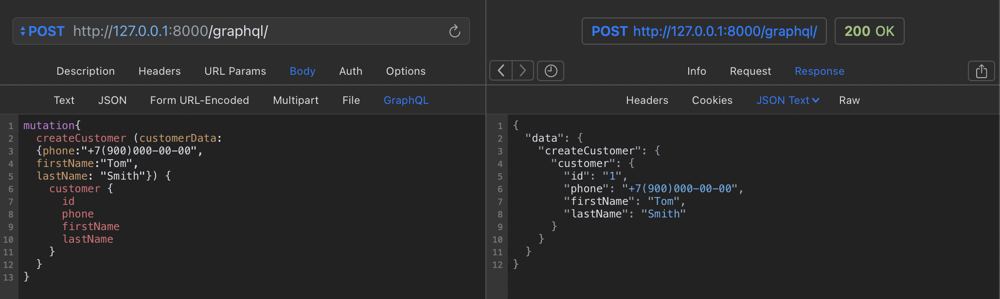

### Изменение карточки клиента

Пользователь может изменить карточку клиента с помощью **updateCustomer mutation**.

Для изменения данных необходимо знать только номер телефона клиента.

Если у клиента поменялся номер телефона - создать новую карточку.

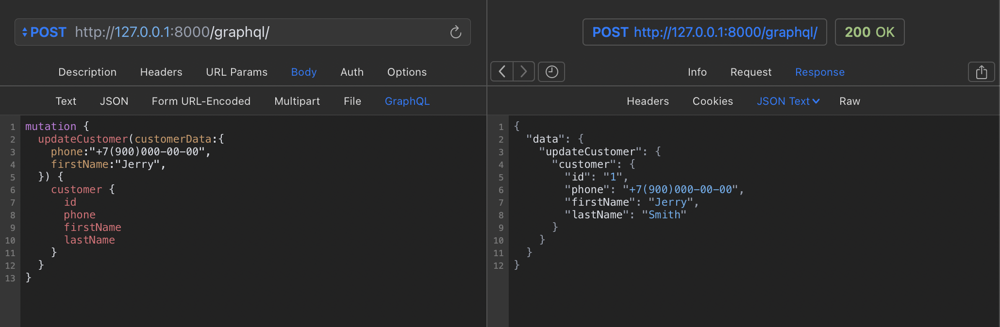

### Удаление карточки клиента

Пользователь может удалить карточку клиента с помощью **deleteCustomer mutation**.

При удалении карточки, в заявках в поле "Клиент" устанавливается пустое значение.

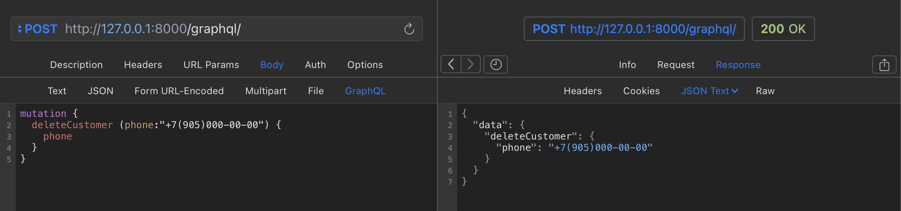

## Заявки

### Структура заявки

1. Номер заявки

2. Дата заявки

3. Клиент

4. Ответственный сотрудник по заявке

5. Тип заявки:

   - Консультация
   - Диагностика
   - Ремонт
   - Замена
   - Возврат

6. Статус заявки:

   - Принята в работу
   - У мастера
   - Готово к выдаче
   - Закрыта

7. Дополнительная информация (описание неисправности, результат консультации и т.д.)

### Получение данных о заявках

Пользователь может получить информацию по всем своим заявкам с помощью **myRequests Query**.

Доступ ко всем заявкам компании возможен через **allRequests Query**

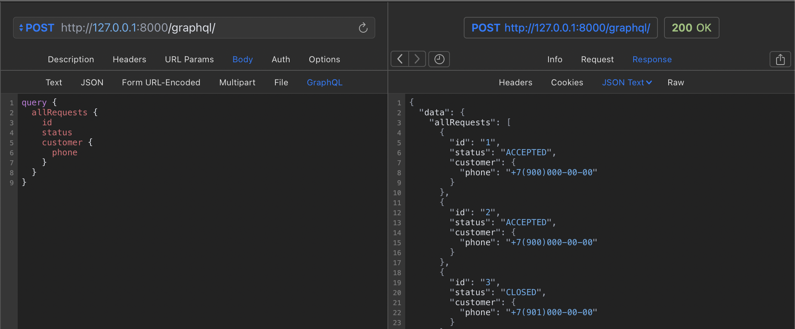

Определенный запрос можно получить по ID или номеру телефона клиента с помощью **requestById Query** и **requestByCustomer Query**.

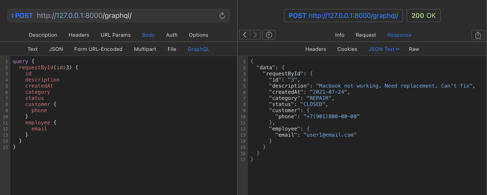

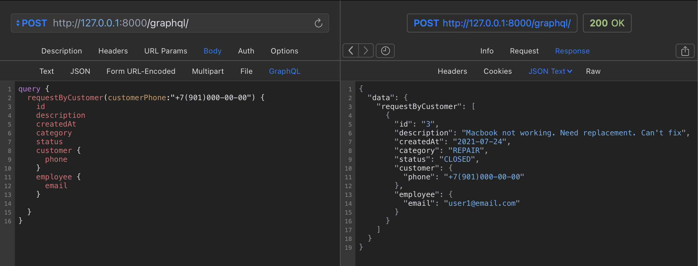

### Фильтрация заявок

Сотрудники могут фильтровать заявки:

- по типу заявки с помощью **requestsFilterCategory Query**.

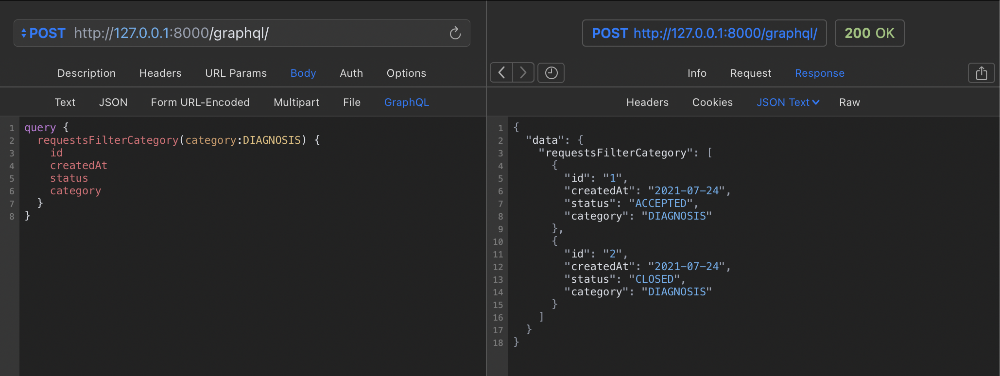

- по одному или нескольким статусам с помощью **requestsFilterStatus Query**.

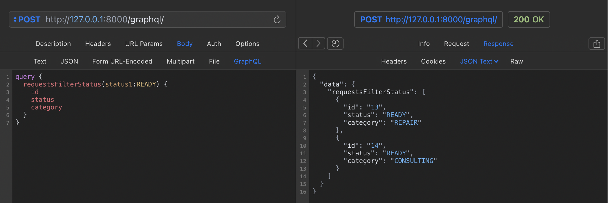

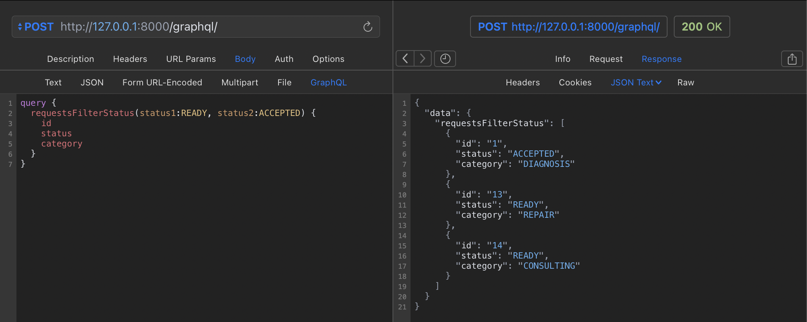

- по дате или интервалу дат с помощью **requestsFilterDate Query**.

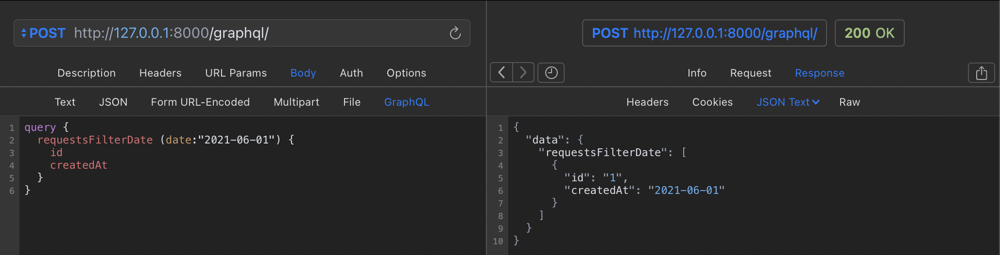

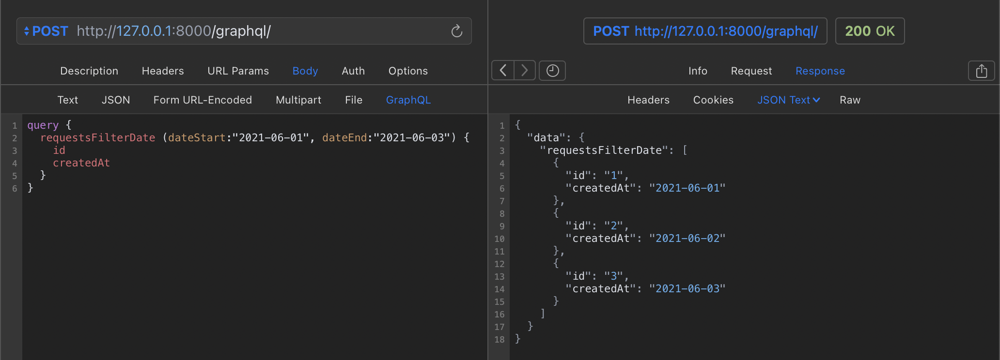

### Создание заявок

Пользователь создает заявки с помощью **createRequest Mutation**.

Клиент заполняется по полю номер телефона. Данные пользователя автоматически заполняются по данным входа.

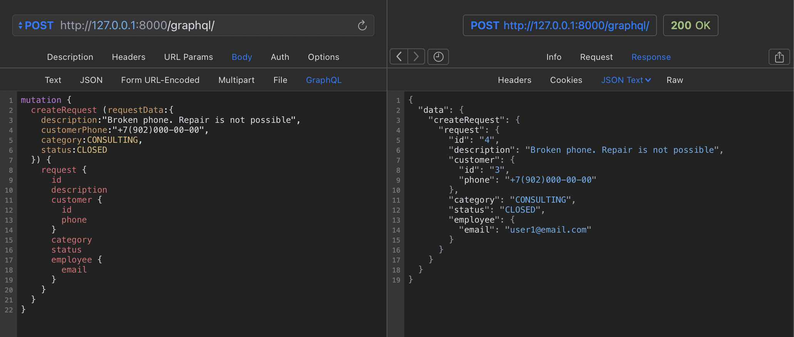

### Изменение заявок

Изменить заявку можно по ее ID с помощью **updateRequest Mutation**.

Доступные поля для изменения: статус, тип заявки, описание.

### Удаление заявок

Удалить заявку можно по ее ID с помощью **deleteRequest Mutation**.

