# CRM для регистрации и обработки входящих заявок от клиентов

## Пользователи

Пользователями сервиса являются сотрудники компании.

### Регистрация и аутентификация

Чтобы зарегистрировать пользователя необходимо воспользоваться **register Mutation**.

Необходимые поля для регистрации: почта и пароль.

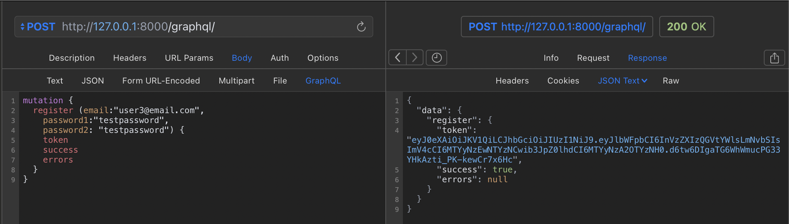

Для входа на сервис используется JWT Token. Получаем его через **login Mutation**.

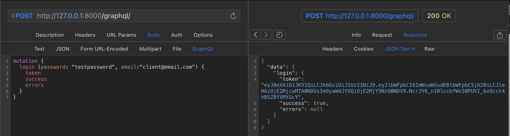

Пользователь может поменять свою почту с помощью **updateUser Mutation**

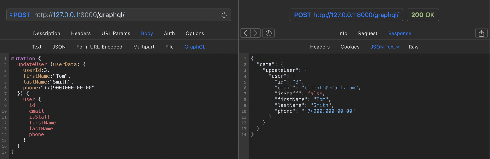

### Получение данных о пользователях

Пользователь может получить свои данные с помощью **me Query**.

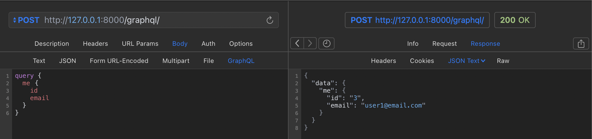

## Заявки

### Структура заявки

1. Клиент

2. Ответственный сотрудник по заявке

3. Техника покупателя

4. Тип заявки:

   - Консультация
   - Диагностика
   - Ремонт
   - Возврат
   - Жалоба
   - Прочее

5. Статус заявки:

   - Открыта
   - Запланирована
   - Отменена
   - Закрыта

6. Описание проблемы от клиента

7. Текущее/окончательное решение проблемы

8. Контактные данные пользователя, если он не зарегистрирован

9. Сообщение для клиента, которое используется в системе оповещений.

### Получение данных о заявках

Пользователь / сотрудник может получить информацию по всем своим заявкам с помощью **myRequests Query**.

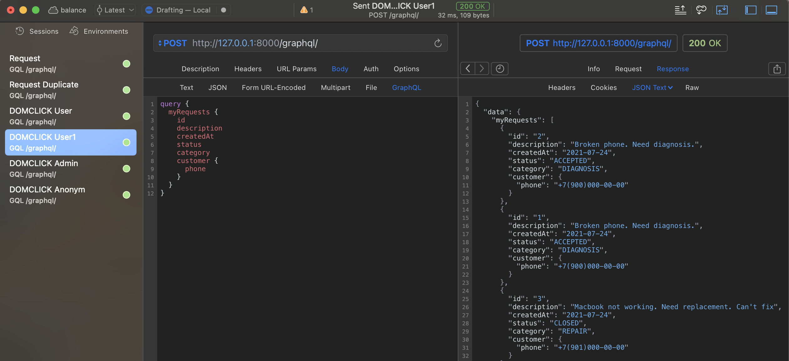

Пользователь / сотрудник может получить данные заявки по ее ID с помощью **request Query**.

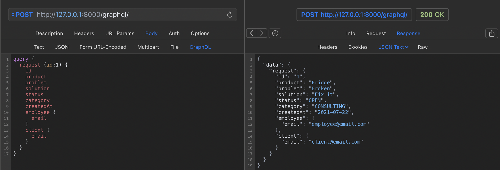

Сотрудники могут получить доступ ко всем заявкам компании с помощью **allRequests Query**.

### Фильтрация заявок

Сотрудники могут фильтровать заявки:

- по статусам и категориям с помощью **allRequestsFilterStatusAndCategory Query** или **myRequestsFilterStatusAndCategory Query**.

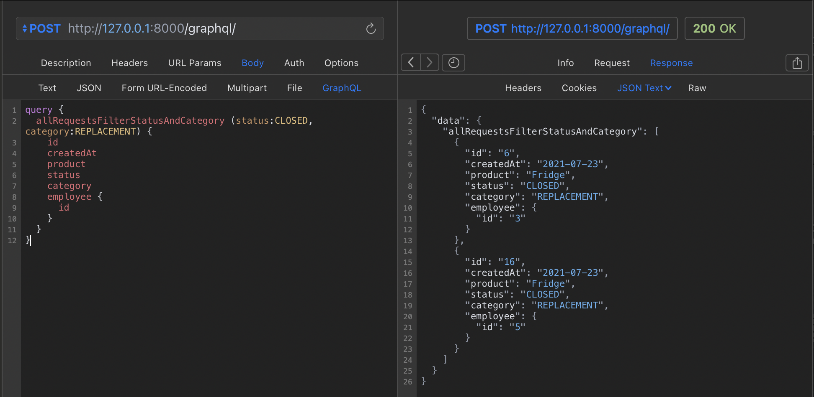

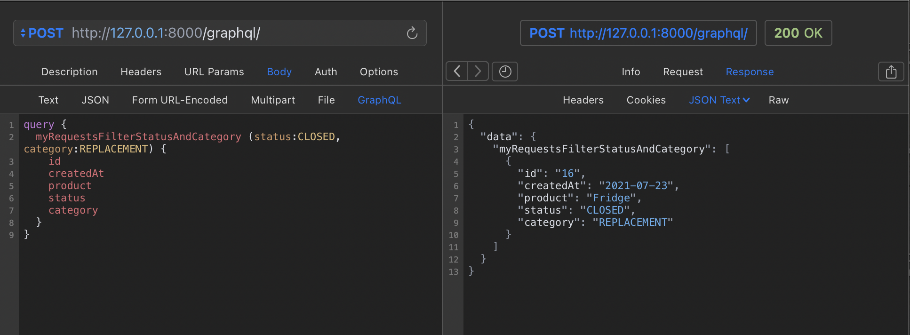

- по статусам или категориям с помощью **allRequestsFilterStatusOrCategory Query** или **myRequestsFilterStatusOrCategory Query**.

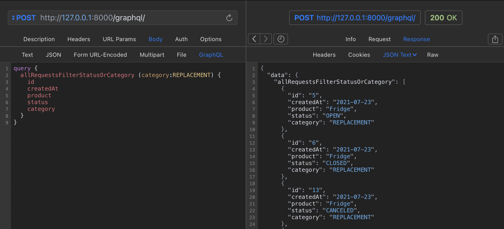

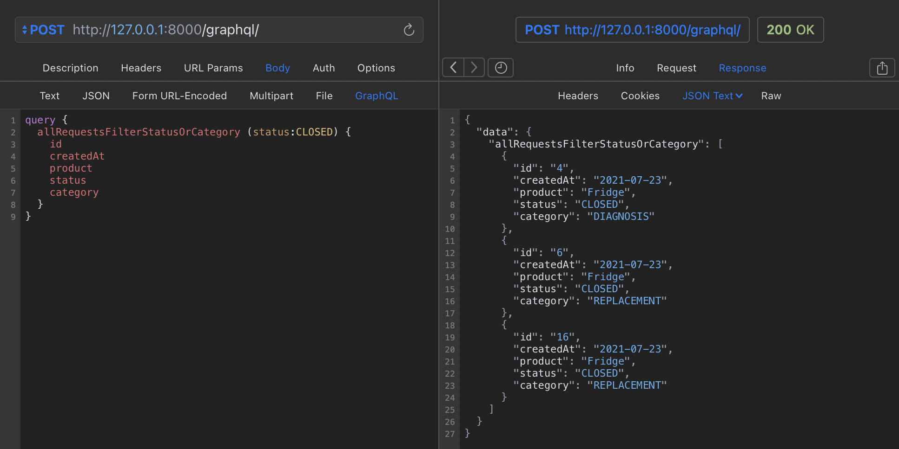

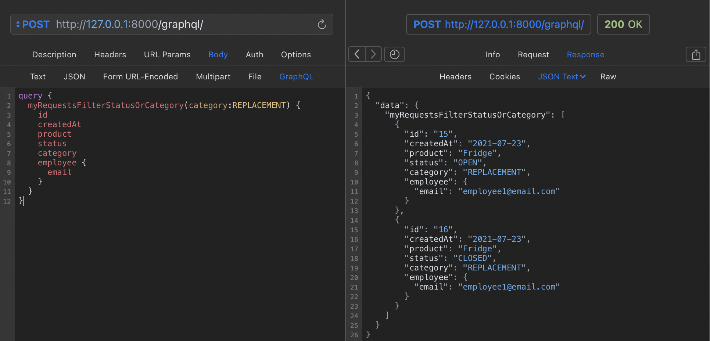

- по дате или интервалу дат с помощью **allRequestsFilterDate Query** или **myRequestsFilterDate Query**.

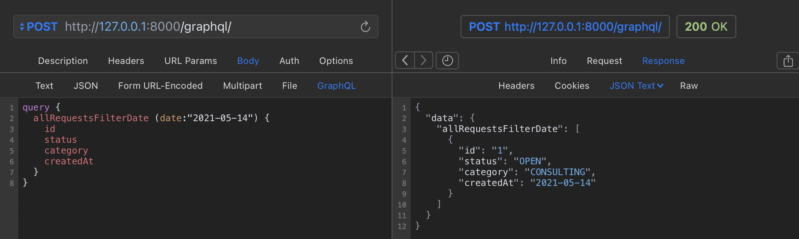

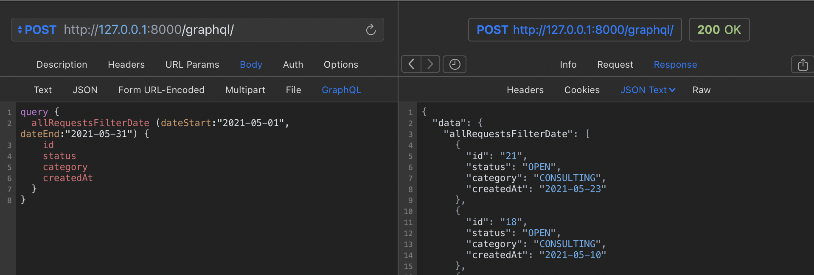

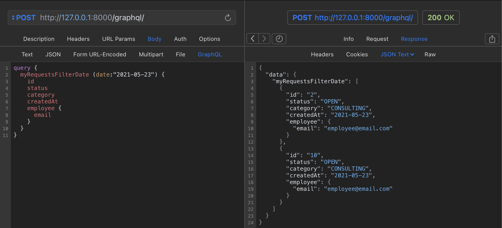

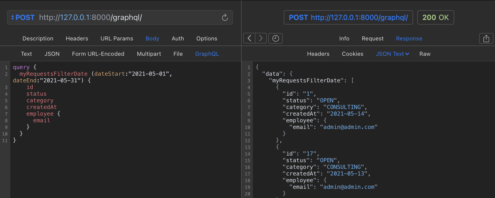

### Создание заявок

Пользователь / сотрудник могут создать заявки с помощью **createRequestClient Mutation** и **createRequestClient Mutation**.

У клиента есть доступ к полям: техника, проблема. Данные клиента автоматически заполняются по данным входа.

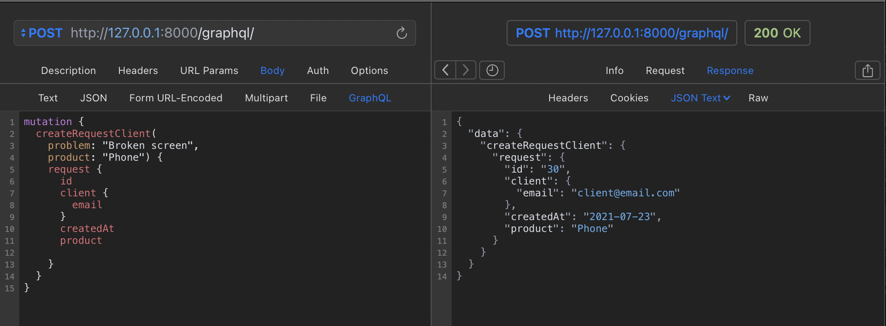

У сотрудников есть доступ ко всем полям. Данные сотрудника автоматически заполняются по данным входа.

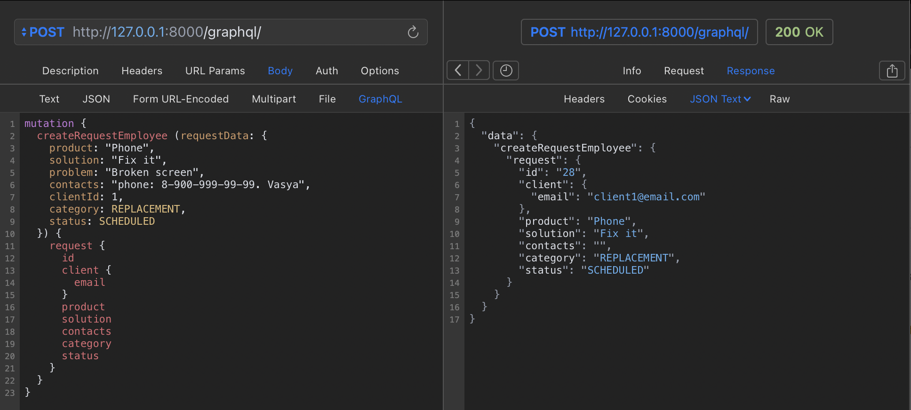

### Изменение заявок

Изменить заявку может только сотрудник ответственный за данную заявку с помощью **updateRequest Mutation**.

У администратора есть доступ ко всем заявкам.

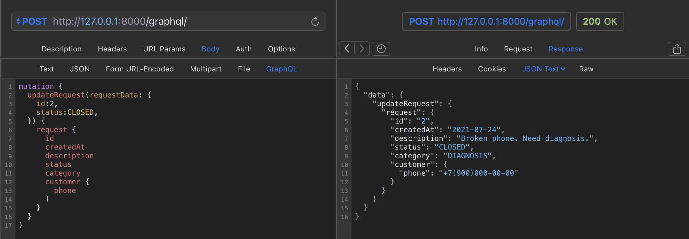

### Удаление заявок

Удалить заявку может только администратор с помощью **deleteRequest Mutation**.

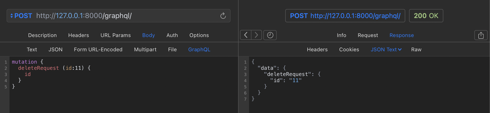
